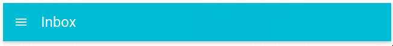
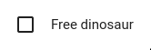
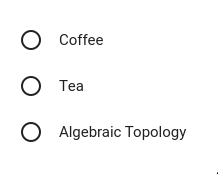
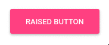
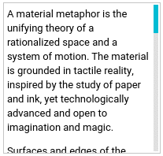
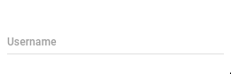
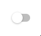

# Qt Material Design Desktop Widgets  

YouTube video preview [available here](http://www.youtube.com/watch?v=21UMeNVBPU4).

<table>
  <tbody>
    <tr>
      <td colspan="2" align="center"></td>
    </tr>
    <tr>
      <td>
        App Bar
      </td>
      <td>
        <code>QtMaterialAppBar</code>
      </td>
    </tr>
    <tr>
      <td colspan="2" align="center">
        
      </td>
    </tr>
    <tr>
      <td>
        Auto Complete
      </td>
      <td>
        <code>QtMaterialAutoComplete</code>
      </td>
    </tr>
    <tr>
      <td colspan="2" align="center">
        
      </td>
    </tr>
    <tr>
      <td>
        Avatar
      </td>
      <td>
        <code>QtMaterialAvatar</code>
      </td>
    </tr>
    <tr>
      <td colspan="2" align="center">
        
      </td>
    </tr>
    <tr>
      <td>
        Badge
      </td>
      <td>
        <code>QtMaterialBadge</code>
      </td>
    </tr>
    <tr>
      <td colspan="2" align="center">
        
      </td>
    </tr>
    <tr>
      <td>
        Check Box
      </td>
      <td>
        <code>QtMaterialCheckBox</code>
      </td>
    </tr>
    <tr>
      <td colspan="2" align="center">
        
      </td>
    </tr>
    <tr>
      <td>
        Circular Progress
      </td>
      <td>
        <code>QtMaterialCircularProgress</code>
      </td>
    </tr>
    <tr>
      <td colspan="2" align="center">
        
      </td>
    </tr>
    <tr>
      <td>
        Dialog
      </td>
      <td>
        <code>QtMaterialDialog</code>
      </td>
    </tr>
    <tr>
      <td colspan="2" align="center">
        
      </td>
    </tr>
    <tr>
      <td>
        Drawer
      </td>
      <td>
        <code>QtMaterialDrawer</code>
      </td>
    </tr>
    <tr>
      <td colspan="2">
        
      </td>
    </tr>
    <tr>
      <td>
        FAB
      </td>
      <td>
        <code>QtMaterialFloatingActionButton</code>
      </td>
    </tr>
    <tr>
      <td colspan="2" align="center">
        
      </td>
    </tr>
    <tr>
      <td>
        Flat Button
      </td>
      <td>
        <code>QtMaterialFlatButton</code>
      </td>
    </tr>
    <tr>
      <td colspan="2" align="center">
        
      </td>
    </tr>
    <tr>
      <td>
        Icon Button
      </td>
      <td>
        <code>QtMaterialIconButton</code>
      </td>
    </tr>
    <tr>
      <td colspan="2" align="center">
        
      </td>
    </tr>
    <tr>
      <td>
        Progress
      </td>
      <td>
        <code>QtMaterialProgress</code>
      </td>
    </tr>
    <tr>
      <td colspan="2" align="center">
        
      </td>
    </tr>
    <tr>
      <td>
        Radio Button
      </td>
      <td>
        <code>QtMaterialRadioButton</code>
      </td>
    </tr>
    <tr>
      <td colspan="2" align="center">
        
      </td>
    </tr>
    <tr>
      <td>
        Raised Button
      </td>
      <td>
        <code>QtMaterialRaisedButton</code>
      </td>
    </tr>
    <tr>
      <td colspan="2" align="center">
        
      </td>
    </tr>
    <tr>
      <td>
        Scroll Bar
      </td>
      <td>
        <code>QtMaterialScrollBar</code>
      </td>
    </tr>
    <tr>
      <td colspan="2" align="center">
        
      </td>
    </tr>
    <tr>
      <td>
        Slider
      </td>
      <td>
        <code>QtMaterialSlider</code>
      </td>
    </tr>
    <tr>
      <td colspan="2" align="center">
        
      </td>
    </tr>
    <tr>
      <td>
        Snackbar
      </td>
      <td>
        <code>QtMaterialSnackBar</code>
      </td>
    </tr>
    <tr>
      <td colspan="2" align="center">
        
      </td>
    </tr>
    <tr>
      <td>
        Tabs
      </td>
      <td>
        <code>QtMaterialTabs</code>
      </td>
    </tr>
    <tr>
      <td colspan="2" align="center">
        
      </td>
    </tr>
    <tr>
      <td>
        Text Field
      </td>
      <td>
        <code>QtMaterialTextField</code>
      </td>
    </tr>
    <tr>
      <td colspan="2" align="center">
        
      </td>
    </tr>
    <tr>
      <td>
        Toggle
      </td>
      <td>
        <code>QtMaterialToggle</code>
      </td>
    </tr>
    <tr>
      <td colspan="2" align="center">
        
      </td>
    </tr>
  </tbody>
</table>

#### Implemented components

- [x] App Bar
- [x] Auto Complete
- [x] Avatar
- [x] Badge
- [x] Check Box
- [x] Circular Progress
- [x] Dialog
- [x] Drawer
- [x] Floating Action Button
- [x] Flat Button
- [x] Icon Button
- [x] Progress
- [x] Radio Button
- [x] Raised Button
- [x] Scroll Bar
- [x] Slider
- [x] Snackbar
- [x] Tabs
- [x] Text Field
- [x] Toggle

#### Work in progress

- [ ] Divider
- [ ] List
- [ ] List Item
- [ ] Menu
- [ ] Paper
- [ ] Snackbar Layout
- [ ] Table

#### Not implemented 

- [ ] Card
- [ ] Chips
- [ ] Discrete Slider
- [ ] Grid List
- [ ] Icon Menu
- [ ] Search Field
- [ ] Select Field
- [ ] Stepper
- [ ] Subheaders
- [ ] Toolbar
